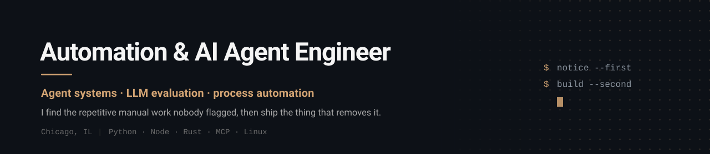

  <picture>
    <source media="(prefers-color-scheme: dark)" srcset="assets/header-dark.svg">
    <source media="(prefers-color-scheme: light)" srcset="assets/header-light.svg">
    
  </picture>

  
  
  

---

I spent three years on a production line watching skilled people do work a computer should be doing. So I built the computer's half. That instinct — **notice the repetitive thing, then remove it** — is the whole job, whether the fix is a hotkey macro or a fleet of agents.

Now I build agent systems and the evaluation harnesses that prove they actually work.

 

## What I've built

<table>
<tr>
<td width="50%" valign="top">

### 🛠️ Macro automation tool
**AutoHotkey · Windows · zero dependencies**

I was a data annotation operator on an autonomy pipeline. Spotted a high-volume repetitive sub-task, built the fix on personal time.

A representative task went **~30s → ~6s (3–5x)** at **99.9% accuracy**. Validated with the engineering team, staged for deployment, SOPs and onboarding docs written solo.

</td>
<td width="50%" valign="top">

### 🤖 Multi-agent system
**Python · Node.js · MCP**

Designed, built, and ran **always-on across a home GPU and a VPS, March–June 2026**. Local-first since.

Sub-agent orchestration, MCP tool integration, file-backed shared state, scheduled execution, auth-gated endpoints, and cost-aware model routing that kept marginal cost near zero.

</td>
</tr>
<tr>
<td width="50%" valign="top">

### 📊 LLM eval harness
**Python · eval-driven development**

Scores model outputs against a **deterministic oracle** — a hand-written game engine used as a known-correct answer key — plus an LLM-as-judge pattern for outputs with no clean ground truth.

Produces defensible accuracy-vs-latency comparisons across models, prompts, and routing choices. "The AI works" should be a measurement, not a vibe.

</td>
<td width="50%" valign="top">

### ⚡ Real-time desktop overlay
**Rust · public APIs**

Native overlay that pulls live data from public APIs and renders it on-screen in real time.

Low-latency rendering, no interference with the host application. Built to learn a systems language under real constraints rather than on a tutorial.

</td>
</tr>
</table>

 

## Stack

**Languages**

**AI & agents**

**Infra & integration**

 

<b>How I work</b>

 

- **Notice first, build second.** The bottleneck nobody flagged is worth more than the feature everyone requested.
- **Measure it or don't claim it.** Every number on this page traces to a hand-timed baseline or a scored eval run. Ranges, not headline figures.
- **Ship the boring version.** Zero dependencies beats a clever framework when someone else has to run it at 3am.
- **Write the docs yourself.** A tool nobody can onboard onto is a tool that dies with you.
- **AI-assisted development daily since 2024** — Cursor, then Claude Code. Agent loops, sub-agent orchestration, and persistent state are how I build, not something I read about.

<b>Background</b>

 

Audio engineering → manufacturing → automation engineering. Not the standard path, and I'd argue that's the point.

Signal processing, latency budgets, and "it has to work live, right now, in front of people" turn out to be the same constraints as real-time systems work. Three years of high-volume production taught me to spot a bottleneck before anyone files a ticket about it.

Currently independent: agent systems, eval harnesses, API integrations, and a technical advisory role with an early-stage product team.

 

---

  Most of my repos are private — client work and things still in progress. Happy to walk through code on a call.

